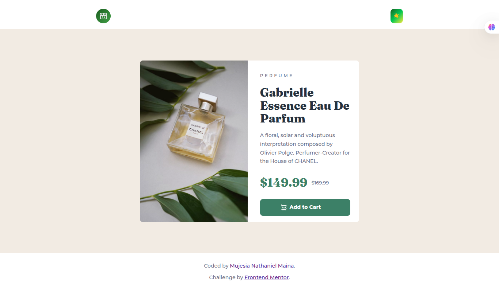
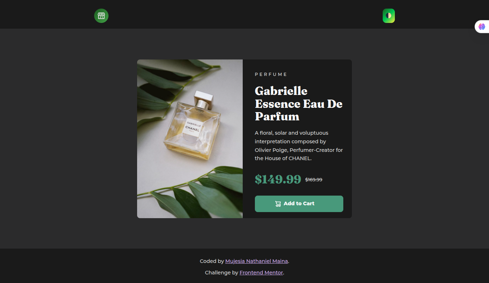
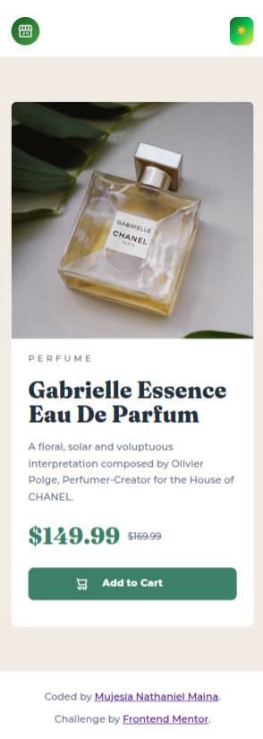
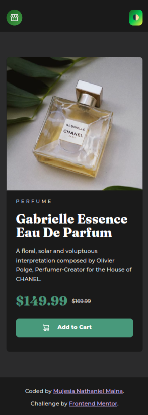

# Frontend Mentor - Product Preview Card Component Solution

This is a solution to the [Product preview card component challenge on Frontend Mentor](https://www.frontendmentor.io/challenges/product-preview-card-component-GO7UmttRfa). These challenges help improve coding skills by building realistic projects.

---

## 📑 Table of contents

- [Overview](#overview)
  - [The challenge](#the-challenge)
  - [Screenshots](#screenshots)
- [My process](#my-process)
  - [Built with](#built-with)
  - [What I learned](#what-i-learned)

---

## 📌 Overview

### 🎯 The challenge

Users should be able to:

- View the optimal layout depending on their device's screen size  
- See hover and focus states for interactive elements  

---

### 📸 Screenshots

#### 💻 Desktop
<p align="center">
  
  
</p>

#### 📱 Mobile
<p align="center">
  
  
</p>


---

## ⚙️ My process

### 🛠 Built with

- Semantic JSX markup  
- CSS custom properties  
- Flexbox  
- CSS Grid  
- Mobile-first workflow  
- React  

---

### 🧠 What I learned

One key thing I learned was how to use the `<picture>` element to serve responsive images based on screen size. This allows better performance and ensures the correct image is displayed depending on the viewport.

```jsx
<div className="preview-card__image">
  <picture>
    <source media="(min-width: 765px)" srcSet={desktopImage} />
    
  </picture>
</div>
```
---

### 🚀 Continued development

- Improve accessibility (ARIA, better alt text)
- Add animations/transitions
